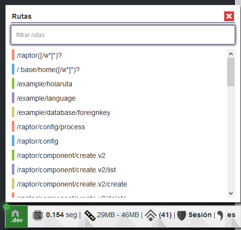

Raptor.js
=======


Raptor.js es un framework de node creado, impulsado y mantenido por el Proyecto Raptor.

Raptor.js es un framework web full stack basado en Node.js, utiliza como core el microframework express de conjunto con otros módulos utilitarios del repositorio npm que permiten el desarrollo de aplicaciones web de forma ágil.

El proyecto propone una arquitectura basada en componentes, donde las responsabilidades de la lógica de nuestra aplicación se encuentran encapsuladas dentro de componentes.

La solución incluye un marco de abstracción de seguridad integrado en un módulo (TroodonNode) que garantiza la implementación de los procesos de identificación-autenticación, autorización y auditoría. Implementa una extensión de los modelos de control de acceso RBAC y CAEM. Además cuenta con un módulo de reconocimiento biométrico por dinámica de tecleo (BioNode), que se inserta dentro del proceso de identificación-autenticación del módulo de seguridad.

Agradecer a todos los colaboradores que hacen posible el proyecto Raptor.

Comenzando
---------------
La nueva serie 2 (versiones igual o superiores a 2.0.0) de Raptor.js trae cambios significativos, el primero está relacionado a su instalación. Esta versión ya está disponible como paquete en el npm y para la creación de un proyecto Raptor.js es necesario la instalación de la herramienta de desarrollo raptor-cli que te asistirá en la creación de proyectos.


### Instalando cli

El cli puede ser instalado tanto del npm como localmente si tenemos las fuentes del paquete.
Desde el npm:
``` batch
> npm install raptor-cli -g
```

Desde las fuentes:
``` batch
> npm install ./raptor-cli.tgz -g
```
Al instalar globalmente el paquete cli a través de flag -g tendremos accesibles en nuestro equipo el comando raptor-cli.

En modo de desarrollo podremos conectar nuestro dispositivo y correr nuestra app
a través del comando `raptor-droid run`. (Recuerde habilitar el modo de desarrollo en su dispositivo)


### Comandos

Una vez instalado el cli podemos usar los comandos disponibles para crear y correr nuestro proyecto.

`create <nombre>`: El comando create crea un nuevo proyecto en el directorio actual con la estructura de la arquitectura propuesta por raptor, adicionalmente crea el package.json e instala las dependencias básicas (node_modules) del proyecto. Desde la versión 2.1.0 fue removida la opción install-offline.

``` batch
> rap create MyApp
```

`run [verbose] [arguments]`: El comando run corre el proyecto del directorio actual en modo de desarrollo, entre otras funciones utiliza nodemon para vigilar los cambios en el proyecto y reiniciar el servicio.

``` batch
> rap run
```

`comp, --create-component`: Crea un nuevo componente dentro del proyecto actual, este comando lanzará un prompt requiriendo el nombre del agrupador y componente.

``` batch
> rap comp
```

`env [set | get | delete | list] <key> <value>`: Modifica las variables de entorno que serán pasadas al proyecto a ejecutar. Es útil para configurar locaciones compartidas del proyecto así como otros parámetros de configuración.

``` batch
> rap set RAPTOR_EXTERNAL_COMPONENT C:\\UbicacionCompartida
```

``` batch
> rap get RAPTOR_EXTERNAL_COMPONENT
```

``` batch
> rap list
```

`dev [import | delete]`: Importa o elimina un componente del área de desarrollo (cli.development).

``` batch
> rap dev import C:\\Path\\uncomponente.zip

> rap dev import http://raptorweb.cubava.cu/uncomponente.zip

> rap dev delete uncomponente

```

`install <agrupador> <zipFile|URL> `: Instala el componente especificado en formato zip en el proyecto actual.

``` batch
> rap install Util C:\\Path\\uncomponente.zip

> rap install Util http://raptorweb.cubava.cu/uncomponente.zip

```


Capítulo 2 – Arquitectura
===========

Las responsabilidades de la lógica de nuestra aplicación se encuentran encapsuladas dentro de componentes, cada componente es ubicado dentro de directorios conocidos como agrupadores o vendors encontrados en la raíz del directorio src.

Además del directorio src encontrarás los siguientes archivos:

`config`: Contiene el archivo options.json con la configuración global del framework.

`public`: Directorio de recursos web, se encuentran las bibliotecas utilizadas del lado del cliente, bootstrap, extjs, angular.js, socket.io y el directorio rmodules que contiene los recursos web de los componentes en src (son copiados por el cli automáticamente en modo de desarrollo).

`src`: Fuentes de nuestra aplicación en forma de componentes reutilizables, los componentes son reconocidos por el sufijo Node, ejemplo exampleNode.

`node_modules`: Directorio de dependencias de paquetes utilizados por el framework.

`app.run.js`: Entrada de ejecución del proyecto en modo de producción.

`bootstrap.js`: Archivo de arranque, utilizado tanto en modo de producción como desarrollo.

`package.json`: Configuración del paquete de proyecto, dependencias utilizadas etc.

Configuración general
-----
Esta configuración sirve como directivas generales para el framework, se establecen en el archivo `options.json` y `options.prod.json` en el directorio `config` de nuestro proyecto. Raptor espera que algunas de las directivas expresadas sean obligatorias, es posible además establecer algunas directivas personalizadas. Desde la versión 2.1.0 se introduce el archivo `options.prod.json`, es la configuración que será leída en modo de producción.

Directivas en options.json.

`mode`: Determina el modo en que correrá el proyecto, acepta 2 valores, development o production. Cuando el modo development se encuentre activo aparecerá en cada ventana el panel minificado con datos básico del request actual, además se activarán algunas opciones de traceo para un mejor proceso de desarrollo.

`database`: Esta configuración controla el orm sequelize utilizado por Raptor, establece la configuración de conexión con la base de datos. Inicialmente el estado de la conexión por defecto es off, para activar la conexión con la base de datos se deberán configurar los parámetros necesarios para establecer la conexión.

`database.state`: Estado de la conexión, acepta 2 valores on para activa,off para inactiva.

`database.options`: Set de opciones esperadas en la configuración de sequelize, está descrita en la api oficial de sequelize.

`database.options.port`: Puerto en el que escucha la base de datos.

`database.options.dialect`: Driver para conectarse al motor de base de datos, sequelize soporta mysql, postgres, tedius y otros más.

`database.options.host`: Dirección del motor de base de datos.

`database.user`: Usuario con el que se va a conectar en la base de datos.

`database.password`: Contraseña del usuario de conexión.

`database.name`: Nombre de la base de datos a la que se desea conectar.

`port`: Puerto en el que estará escuchando el servidor web, por defecto Raptor propone el 4440.

`socketio`: Tecnología de conexión bidireccional por socket, establece el objeto de configuración del socket de conexión.

`socketio.active`: Establece si socketio estará activo o no, espera como valor un booleano.

`language`: Objeto de configuración del lenguaje, es usado por Raptor para configurar el idioma por defecto.

`language.default`: Lenguaje por defecto, se especifica la abreviatura del lenguaje a utilizar, ejemplo “es”.

`language.usePrefered`: Determina si Raptor deberá darle prioridad a la directiva enviada por el navegador de lenguaje de preferencia, espera como valor un booleano.

`language.cookieName`: Nombre de la cookie de lenguaje.

`panel`: Objeto de configuración que establece las directivas del panel de control visual de Raptor.

`panel.secure`: Establece si el panel de control estará protegido por contraseña, espera un booleano. Generalmente esta configuración nunca es editada manualmente, es realizada a través del propio panel.
panel.username: Este valor es obligatorio solo cuando panel.secure sea true, establece el nombre de usuario a utilizar en el panel de control.

`panel.password`: Contraseña del usuario configurado para el panel de control.

`secret`: Llave secreta generada, es utilizada en el framework como semilla para los procesos de cifrado y configuración de sesiones.

`proyectName`: Nombre del proyecto, generalmente es establecido en el propio panel.

`http`: (Opcional, Modo de desarrollo) Array con los patrones de archivos a ignorar por raptor-cli (nodemon).

`scopes`: (Opcional) Array con los nombres de los scopes, indica al framework que debe leer cada uno de estos scope en node_modules en busca de nuevos componentes Raptor.js, es útil cuando instalamos un componente Raptor.js a través del npm y es ubicado en el directorio node_modules, Raptor lee por defecto el scope @raptorjs donde están ubicados los componentes del core del framework.

`publish`: (Opcional) Objeto con los nombres de las tecnologías ubicadas en node_modules que queremos exponer a través de express en el directorio public del framework, pueden ser bootstrap, angularjs etc.

`maxEventListeneres`: Límite máximo de subscripciones a eventos que el core de Raptor.js soportará, por defecto el valor aparece en 80.


``` json
{
  "mode": "development",
  "database": {
    "state": "on",
    "options": {
      "port": 3306,
      "dialect": "mysql",
      "host": "127.0.0.1"
    },
    "api": true,
    "password": "root",
    "user": "root",
    "name": "raptorjs"
  },
  "port": 4440,
  "socketio": {
    "active": false
  },
  "language": {
    "default": "es",
    "usePrefered": false,
    "cookieName": "RpsLang"
  },
  "panel": {
    "secure": true,
    "password": "admin",
    "username": "admin"
  },
  "secret": "3dfa5h2g$ae946e2gdi5cb%g*1#$5e25",
  "proyectName": "RaptorJS"
}
```

Arquitectura de un componente
-----
Los componentes son la base fundamental del framework, toda la lógica de la aplicación estará descrita en ellos. Un principio fundamental es que cada componente debe ser independiente en funcionamiento siempre que sea posible, aunque se pueden establecer dependencias entre ellos. Debido a este principio Raptor promueve las relaciones débiles en forma de introspección, permitiendo que ante la ausencia de una dependencia de componente el sistema continúe su funcionamiento mediante otro flujo de ejecución.

Cada componente posee un manifiesto (`manifest.json`) que describe los metadatos del componente, nombre, versión, descripción y si tiene alguna dependencia con otro componente. En caso de poseer una dependencia el componente será desactivado si esta no se puede resolver.

``` json
{
  "state": false,
  "name": "troodon",
  "author":"William Amed - watamayo90@gmail.com",
  "description":"Descripción del componente",
  "version": "1.0.1",
  "require":{
    "core":">=1.0.1"
  }
}

```

Adicionalmente también contará con un archivo (`package.json`) que describe al componente y sus dependencias ante el gestor de paquetes npm.

``` json
{
  "name": "@raptorjs/troodon",
  "author":"William Amed - watamayo90@gmail.com",
  "description":"Descripción del componente",
  "version": "1.0.1",
  "dependencies":{
    "fs-extra":">=1.0.1"
  }
}

```

Ubicaciones compartidas (Nuevo)
-----
A partir de la versión 2.0.7 el framework soporta las ubicaciones compartidas, tanto para ambientes de desarrollo como de producción. En principio la ubicación principal de un componente será el directorio src del propio proyecto en ejecución, además podrán ser configuradas otras locaciones donde se encontrarán componentes de uso común para otros proyectos.

### Ubicaciones de desarrollo

Como particularidad en modo de desarrollo se añaden otras 2 locaciones que siempre estarán disponibles cada vez que se ejecute el proyecto a través de raptor-cli. Estas locaciones de modo de desarrollo pueden ser encontradas en:

`$USER_DOCUMENTS/raptor.cli.dev/cli.development`

`$NPM_GLOBAL/node_modules/raptor-cli/node_modules/@raptorjs`

Su función es contener componentes usados solamente en desarrollo y que representan utilitarios comunes que son utilizados en cada uno de los proyectos.


En el diagrama anterior los componentes pueden ser identificados como los rectángulos verdes asociados a los proyectos o en el cli asociados a un agrupador cli.development.

Los componentes de desarrollo estarán contenidos en un agrupador llamado cli.development tanto en la primera locación como en la segunda locación de desarrollo.

### Ubicaciones de uso común

Otras ubicaciones que pueden ser configuradas son las ubicaciones de uso común, representan ubicaciones que se compartirán entre proyectos que usan los  mismos componentes utilitarios de producción ej. ngPortal. El objetivo es centralizar el componente, evitar la duplicidad de código que conlleva a una mejor mantención.

Las ubicaciones de uso común son configuradas a través de la variable de entorno `RAPTOR_EXTERNAL_COMPONENT`, donde se especifica la dirección física donde se encuentran los componentes.


Estructura del componente
-----
Los componentes son la base principal de nuestro proyecto, toda la arquitectura está basada en la comprensión del concepto componente, la lógica de nuestra aplicación deberá estar contenida en uno que de principio puede ser independiente en funcionamiento de otro componente aunque pueden establecerse dependencias.

Un componente está organizado de la siguiente forma:
### Controllers
`Controllers`: En el directorio Controllers estarán los controladores de nuestro componente, son descritos utilizando la especificación ES6 y la clase definida deberá extender de Controller. Los controladores servirán como forma de definición de acciones para ejecución de patrones de ruta, para esto se utilizará la anotación @Route, que le podrá ser especificada la ruta, method, before (array con acciones a realizar delante de la función actual), after (array con acciones a realizar detrás de la función actual). Luego de los parámetros req, res, next podrán ser inyectadas dependencias definidas en el DI(Inyector de dependencias) de Raptor.

``` javascript
'use strict';

/**
 * prefijo de ruta todas las definiciones en el controlador
 * 
 * @Route("/example") 
 */
class MiControlador extends R.Controller {

    configure() {

    }

    /**
     *  
     *  @Route("/holaruta",method="all")
     * 
     */
    holaRuta(req, res, next) {
        res.send('hola ruta')
    }

}

module.exports = MiControlador;

```
### Models
`Models`: Contendrá los modelos sequelize generados, la forma en que se definen puede consultarse en la documentación del orm sequelize, Raptor.js genera automáticamente estas clases  a partir del panel de control de forma visual e intuitiva.
``` javascript
module.exports = function(sequelize, DataTypes) {
  return sequelize.define('users', {
    id: {
      type: DataTypes.INTEGER(11),
      allowNull: false,
      primaryKey: true,
      autoIncrement: true
    },
    username: {
      type: DataTypes.STRING(255),
      allowNull: true,
      unique: true
    },
    password: {
      type: DataTypes.STRING(255),
      allowNull: true
    }
  }, {
    tableName: 'users'
  });
};
```
### Repositories

`Repositories`: Los repositorios no son un concepto manejado por sequelize sino que son controlados por Raptor.js, la filosofía de repositorios se hereda de otras tecnologías para cumplir el principio de división de responsabilidades en los modelos, separar el mapeo relacional de la lógica de consultas. En Raptor es vital separar los modelos (Models) mapeados de la definición de consultas o funciones definidas para estos modelos (Repositories), ya que si se remapea un modelo el repositorio se encarga de mantener las funciones personalizadas definidas para él.
``` javascript
'use strict';
module.exports={
    initRepo:function(){
        //algunas tareas al inicializar el modelo
        //Por ejemplo, establecer las relaciones con otros modelos.
	  //Si se remapea el modelo de este repositorio por algún cambio
        //en los campos de la tabla, este repositorio no se vería afectado
        //manteniendo las consultas personalizas programadas anteriormente
    },    
    getUsers:function(query){
        return this.findAll(query);
    }
}
```

### i18n

`i18n`: Este directorio contiene un archivo denominado language.json, en este son configurados los mensajes para cada uno de los idiomas que soporta el componente, cada mensaje está representado en un objeto donde para cada idioma es establecido la traducción correspondiente.
``` json
{
    "prueba":{
        "en": "test",
        "ru": "тест"
    }
}
```
### Resources

`Resources`: En este directorio estarán todos los recursos web utilizados del lado del cliente, css, imágenes y archivos javascript, aunque este directorio no está público para el servidor web raptor-cli se encarga de copiar automáticamente estos recursos hacia el directorio public para que sean visibles, son copiados en la misma estructura propuesta en src.

Un archivo ejemplo.css ubicado dentro del directorio Resources será cargado en nuestra plantilla de la siguiente forma:
``` html
<link href="/public/Hola/exampleNode/ejemplo.css">
```
A partir de la versión 2.1.0 Raptor expone un middleware encargado de resolver los recursos ubicados en el directorio Resources de cada componente, todas las rutas que comiencen con /public pasarán por este middlare en busca de los recursos web especificados.

Este principio de funcionamiento refuerza la modularidad del componente, donde podemos reutilizar el componente simplemente copiando el mismo hacia el proyecto que deseemos.

### Views

`Views`: Aquí estarán todas las plantillas del componente, Raptor utiliza como motor de plantillas a Ejs, a las plantillas es posible pasarle datos que serán compilados e insertados dentro de la definición html descrita.
``` html
<html>
    <body>
        <b>hola mundo <%= msg %></b>
    </body>
</html>
```
### index.js

`index.js`: Esta clase representa la entrada lógica principal de cada componente, posee un grupo de funciones que le dan configuración al componente así como definir el prefijo de ruta del componente, hacer introspección, capturar eventos y definición de middlewares en el stack de express.
``` javascript
'use strict';
/**
* Raptor.js - Node framework
* 
* @Route("/example")
*/
class exampleNode {
   /**
    * 
    */
    middleware(router){
        
    }

   /**
    * 
    */
    configure(R){
        
    }

}
module.exports=exampleNode
```

Capítulo 3 – Clase principal (index.js)
===========

La clase index.js ubicada en cada componente es la entrada lógica principal del mismo, representa al componente en términos de funcionamiento ante el core de Raptor y se encarga de configurar opciones globales para su funcionamiento. En la clase se configurarán 3 conceptos principales, el prefijo de ruta del componente, la configuración inicial y middlewares o rutas que deseemos registrar.

Prefijo de ruta
-----

El prefijo de ruta del componente sirve como forma de agrupación de las rutas que se registren en este propio componente, si se establece significa que todas las rutas declaradas en los controladores dentro del componente tomarán como prefijo el establecido en esta clase.

``` javascript
'use strict';
/**
* Raptor.js - Node framework
* 
* @Route("/examples")
*
*/
class exampleNode {
   /**
    * 
    */
    middleware(router){
        
    }

   /**
    * 
    */
    configure(R){
        
    }

}
module.exports=exampleNode
```

En el ejemplo se puede apreciar que la clase principal exampleNode define un prefijo de ruta `/examples` a través de la anotación `@Route`, significa que si dentro de este componente se define por ejemplo una ruta `/users`, entonces la ruta de acceso en el navegador será `/examples/users`. 

Configuración
-----

La configuración inicial se realiza a través del método `configure` presente en esta clase, este método se invoca una vez que el servidor arranca y el core de Raptor ha leído y preparado los metadatos del componente. El método es llamado una sola vez, antes que incluso se configure el stack de express, por lo que sirve para realizar acciones de registro de middlewares personalizados e introspección en el propio funcionamiento del framework.
Es posible además suscribirse a eventos generados por el framework y otros componentes a través del objeto Events que puede ser inyectado en el método.

``` javascript
'use strict';
/**
* Raptor.js - Node framework
* 
* @Route("/example")
*/
class exampleNode {

    middleware(router){

    }

   /**
    * Raptor.js - Node framework
    * 
    * Entrada de configuracion del componente
    * se ejecuta cuando se registran los componentes
    * 
    * @param Raptor R instancia de la aplicacion Raptor
    *
    */
    configure(R, Events, express) {

        Events
            .register({
                'ready': function () {
                    console.log("Raptor.js listo y escuchando.")
                },
                'database:running':function(){
                    console.log("La base de datos se encuentra corriendo")
                }
            })
        
        express.use(function(req,res,next){
            /**
             * Registro de un middleware de express
             * antes de que Raptor comience a agregar los
             * middleware por defecto
             */
            next()
        })
    }

}

module.exports=exampleNode
```
Middlewares
-----
Para entender un poco de que se trata esta configuración hay que definir qué es un middleware y que función tiene dentro del framework. Raptor.js utiliza a Express como marco de aplicación web o marco de servidor estándar para encargarse del manejo del direccionamiento web y provee todas las funciones básicas del manejo del protocolo http.

Express se basa en un concepto llamado stack de middlewares, no es más que una consecución de bloques de código encapsulados en funciones que se encargan de manipular la petición (Request) y respuesta (Response) para otorgar una función en específico al framework. Adicionalmente cada middleware posee una referencia al próximo middleware dentro del stack (el mismo principio que una lista simplemente enlazada).

En un servidor con express son configurados un conjunto de middlewares indispensables, encargados de manipular las cabeceras de la petición entrante antes de que llegue al enrutador, el enrutador que también es un middleware manipula el request para encontrar una ruta definida que coincida con el patrón de ruta de la petición (digamos /user/list), en caso de encontrarlo lo ejecuta y se detiene la ejecución del stack, en caso contrario invoca al próximo middleware del stack. Generalmente luego del enrutador se registra un middleware que servirá una página 404, esto se debe a que por lógica si el enrutador no encontró una ruta registrada entonces el próximo middleware es el manejador de la lógica que se encargará de informar al usuario de una página no encontrada.

Raptor.js configura todos estos conceptos por nosotros y solo debemos preocuparnos de definir nuestros patrones de ruta. En algunos casos necesitamos registrar nuestros propios middlewares que queramos ejecutar antes o después del enrutador, para esto utilizamos la función middleware definida en la clase index de cada componente. En esta función podemos registrar tanto un middleware como un patrón de ruta que queramos ejecutar antes de los patrones de ruta definidos en el propio componente.

``` javascript
'use strict';
/**
* Raptor.js - Node framework
* 
* @Route("/examples")
*
*/
class exampleNode {
   

    middleware(express, router){
        //express.use espera una función que representa el middleware
        express.use(function(req,res,next){
            /**
             * Le añadimos al objeto request una función 
             * personalizada que estará diponible
             * en los middlewares subsiguientes
             */
            req.funcionPersonalizada=function(){
                res.send("hola mundo")
            }
            /**
             * Ejecutamos el próximo middleware 
             * del stack para continuar 
             * con el flujo de la aplicación
             */
            next()
        })
        //Registro de un patrón de ruta directamente en el enrutador
        router.all("/user/list",function(req,res,next){
            /**
             * Ya en el enrutador podemos utilizar la 
             * función definida en el request, anteriormente
             * definido por nuestro middleware
             */
            req.funcionPersonalizada()
        })

    }

   
    configure(R){
        
    }

}
module.exports=exampleNode
```

Es posible además registrar middlewares para el manejo de excepciones luego que se ejecute el enrutador, ya que nuestra lógica siempre contendrá de alguna forma excepciones personalizadas, un middleware que las gestione resulta en una solución elegante y reutilizable.

``` javascript
'use strict';
/**
* Raptor.js - Node framework
* 
* @Route("/examples")
*
*/
class exampleNode {
   

    middleware(express, router){
        express.use(function(err,req,res,next){
            /**
             * Si se define el parámetro err
             * el middleware es ejecutado cuando
             * exista un error en los middlewares
             * superiores del stack
             */
            console.log(err)
        })

    }

   
    configure(R){
        
    }

}
module.exports=exampleNode
```

Capítulo 4 – Controladores
======
Los controladores son clases definidas dentro del directorio Controllers, encargados de la descripción de la interacción entre la capa de presentación (Frontend) y la capa de negocio (Backend). Estas clases heredan de Controller y en ellas pueden ser definidos metadatos en forma de anotaciones que lo vinculan con el enrutador (@Route), pudiendo en ellas definirse respuestas a determinados patrones de ruta o sea peticiones hechas a través de un cliente http.

A partir de la versión 2.1.3 se comienza a utilizar la anotación @Controller para marcar la clase como controladora, sigue teniendo soporte legacy la herencia de R.Controller. Al existir la anotación @Controller en la definición de la clase el framework internamente preparará la herencia sobre la clase R.Controller.

``` javascript
'use strict';

/**
 * prefijo de ruta todas las definiciones en el controlador
 * 
 * @Route("/example") 
 * @Controller
 */
class MiControlador {

    configure() {

    }

    /**
     *  
     *  @Route("/holaruta",method="all")
     * 
     */
    holaRuta(req, res, next) {
        res.send('hola ruta')
    }

}

module.exports = MiControlador;
```
Lo anterior es el equivalente a invocar directamente:
``` javascript
router.all("/example/holaruta",function(req,res,next){
   res.send("hola ruta")
})
```

Debido un principio arquitectónico, de mantenibilidad y escalabilidad, los controladores ofrecen mejores características además de un soporte directo al DI (Inyector de dependencias) de Raptor.js que estaremos abordando más adelante.
En las anotaciones @Route pueden ser especificadas otras funciones que queramos ejecutar antes o después de la función marcada con la anotación. Los atributos utilizados para este propósito son before y after, donde ambos esperan un array con las referencias de las funciones que queremos ejecutar.
``` javascript
    holaMundoPrimero(req,res,next){
        console.log('Esta función se ejecuta primero en el stack !!')
        //Darle paso al próximo elemento en el stack
        next()
    }

    /**
     * @Route("/ejemplo/holamundo",before=[this.holaMundoPrimero])
     */
    holaMundo(req,res,next){
        console.log("Esta función se ejecuta después");
        res.send("Hola mundo !!")
    }
```

De igual manera también podemos ejecutar funciones luego de la función principal
``` javascript
    holaMundoUltima(req,res,next){
        console.log('Esta función se ejecuta último en el stack !!')
        
    }

    /**
     * @Route("/ejemplo/holamundo",after=[this.holaMundoUltima])
     */
    holaMundo(req,res,next){
        console.log("Esta función se ejecuta primero");
        res.send("Hola mundo !!")
        //Darle paso al próximo elemento en el stack
        next()
    }
```


Capítulo 5 – Inyector de dependencias ($injector)
=====
El DI o inyector de dependencias aparece en esta serie 2 de Raptor.js y juega un papel fundamental en la nueva concepción del framework, resulta indispensable conocer su funcionamiento ya que los objetos, clases y funciones utilitarias, son registradas en el contenedor de dependencias del inyector con el fin de hacerlos accesibles desde cualquier parte de nuestra aplicación. Su concepción estuvo basada en el popular inyector propuesto por AngularJS aunque existen patrones bien definidos sobre esta técnica.

El core de Raptor.js configura el inyector a través del objeto global $injector, significa que estará accesible desde cualquier lugar y en cualquier momento de ejecución del framework. El contenedor del inyector almacena las dependencias en forma clave-valor, donde la clave con la que se registra una dependencia será el nombre con la que será accesible.

Un ejemplo de registro de dependencia.
``` javascript
  var persona=new Persona();
  $injector("ObjetoPersona",persona)
```

Al registrar en el contenedor la instancia o dependencia podemos desde cualquier lugar de nuestra app obtener la instancia registrada.

Existen 2 formas fundamentales de consumir la instancia registrada, directa y por inyección, la forma directa involucra el llamado al objeto global $inyector pasándole como único parámetro el nombre de la dependencia que se desea obtener, mientras que por inyección se basa en invocar una función que recibirá como parámetros las dependencias requeridas en la propia función.

Forma directa:
``` javascript
  var persona=$injector("ObjetoPersona")
  persona.nombre()
```
Por inyección:
``` javascript
        /**
         * El método invoke ejecuta automáticamente la
         * función especificada, resolviendo las
         * dependencias descritas en los parámetros de dicha
         * función, los nombres de los parámetros deberán
         * coincidir con la clave con la que fue registrada
         * la dependencia
         */
        $injector.invoke(function(ObjetoPersona){
            ObjetoPersona.nombre()
        })

        /**
         * invokeLater es similar, en vez de ejecutar
         * automáticamente la función devuelve otra función que luego será
         * ejecutada con la resolución de las dependencias
         */
        $injector.invokeLater(function(ObjetoPersona){
            ObjetoPersona.nombre()
        })
```
Aunque en los ejemplos se está accediendo directamente desde el inyector, Raptor.js implementa internamente la resolución de dependencias en los métodos configure y middleware de la clase principal index del componente, así como en cada acción de los controladores que definan una ruta.
``` javascript
class exampleNode {

    middleware(SecurityRegistry, Bio, ngPortalRegistry, router){
        //Se pueden inyectar acá todas las dependencias 
  //registradas en el contenedor
        router.post("/api/v2",function(){})
    }
```
En las acciones de los controladores también puede hacerse uso del inyector de dependencias luego de los parámetros obligatorios req, res y next.
``` javascript
    /**
     *  El prefijo de esta ruta es el declarado en la cabecera
     *  de esta clase.
     *  Pueden ser inyectadas las dependencias requeridas a continuación
     *  de req,res,next
     *  
     *  @Route("/holaruta",method="all")
     * 
     */
    holaRuta(req, res, next, SecurityRegistry, Op, sequelize, queryInterface) {
        /**
         * Las inyecciones de dependecias Op, sequelize y queryInterface
         * solo estarán disponibles si existe una conexión exitosa con
         * una base de datos
         */
        res.send('hola ruta')
    }
```
Raptor.js configura en el inyector un grupo de dependencias del propio framework así como otras dependencias configuradas por los componentes instalados. En el siguiente listado se encuentran las dependencias registradas por Raptor.

Inyectado desde anotación
-----
En la versión 2.1.3 del core se incluye la forma de inyectado por anotación, esta técnica solo podrá ser usada en los métodos de las clases ES6. Debes tener en cuenta que las acciones de un controlador marcadas con @Route ya realizan está técnica para la resolución de dependencias.

Concretamente podemos marcar los métodos de una clase con la anotación `@Inyectable` para resolver dependencias, esto evita que en algunos casos podamos envitarnos llamar a `$i.invoke` directamente.

``` javascript
/**
 * 
 * 
 * @Route("/galaxia")
 * @Controller
 */
class Thanos{

	configure(){
		
    }
    
    /**
     * @Inyectable
     */ 
	destroyHumans(Options){
        console.log(Options)
	}

    /**
     * @Route("/gotoearth")
     */
	goToEarthAction(req,res,next){
		this.destroyHumans();
		res.send("Welcome thanos");
	}
}
module.exports=Thanos;
```

``` javascript

class Humanos{

	constructor(){
		
    }
    
    /**
     * @Inyectable
     */ 
	caminar(Options, express, SecurityRegistry){
        // Algo que deseas hacer
        express.use(function(req,res,next){
            // y algo más
            next()
        })
	}

    
	empezar(){
		this.caminar();
	}
}
module.exports=Thanos;
```

Dependencias
-----

### sequelize
Instancia creada de la conexión activa con la base de datos configurada por Raptor, aunque esta es la conexión activa principal se pueden crear otras instancias y registrarlas en el contenedor de dependencias.

### queryInterface
Referencia al queryInterface de la instancia principal de sequelize activa.

### Op
Objeto que contiene los operadores utilizados en las consultas en sequelize, like, or, and, not etc.., en las últimas versiones del ORM es la forma recomendaba de establecer los operadores en las consultas.

### Annotations
Contiene la definición de la clase Reader para leer anotaciones, está determinado por el paquete ecmas-annotations.
### AnnotationFramework
Contiene el registro de anotaciones definidas que serán leídas y procesadas.
### R
Instancia del core de Raptor.
### SecurityRegistry
Objeto que contiene el registro de manejadores de seguridad definidos, los SecurityManager registrados implementan los procesos de autenticación, autorización y auditoria, el componente TroodonNode define su propio manejador en este contenedor.
### router 
Referencia al enrutador de express
### express
Referencia a la app express creada por Raptor.js
### Template404
Contiene la ruta de la plantilla 404 a utilizar por Raptor.js, es posible redefinir esta ruta para establecer una plantilla propia personalizada.
### TemplateBasic
Contiene la ruta de la plantilla genérica a utilizar por Raptor.js, es posible redefinir esta ruta para establecer una plantilla propia personalizada.
### TemplateERROR
Contiene la ruta de la plantilla de error a utilizar por Raptor.js, es posible redefinir esta ruta para establecer una plantilla propia personalizada.
### Events
Objeto para el registro de escuchas de eventos en Raptor.js, es utilizado generalmente en el configurador de componentes escuchando determinados eventos generados por el sistema y por componentes instalados.
### Options
Objeto que contiene la configuración establecida en el archivo options.json.
### Migration
Objeto que contiene métodos utilitarios de las funcionalidades de migración, Ej. reIndex para reindexar las sequencias en esquemas postgres y Oracle.
### Umzug
Gestor de migraciones.
### DefaultSession
Contiene un valor booleano que define si se utilizara la sesión por defecto configurada por Raptor.js, es posible manipular este valor para definir un manejador de sesión nuevo.
### nombre-de-componente_nombre-de-modelo
Raptor.js registra además en el contendor las referencias a los modelos sequelize definidos en los componentes instalados. La forma de acceder a ellos mediante el inyector es: nombre del componente sin el sufijo bundle donde está ubicado el modelo, seguido de un guión bajo y luego el nombre del modelo, ejemplo Troodon_security_users, esto se refiere que inyectaremos el modelo security_users que se encuentra en el componente TroodonNode.

Otras dependencias
-----
### ngPortal
Definición de la clase ngPortal del componente ngPortalNode, se utiliza para configurar un portal.
### ngPortalRegistry
Registro de instancias de portales creados con ngPortal.
### Bio
Objeto registrado por el componente biométrico para la protección con patrón de tecleo de determinadas rutas, a través del método protection devuelve un middleware que será utilizado para controlar el acceso en diferentes rutas.

$injector API
-----
### $injector()
@param {string} Llave nombre de la dependencia.

@param {string} value Valor a registrar en la dependencia especificada.

@return null | mixed

Esta función es utilizada tanto para registrar como para obtener las dependencias, si no se especifica el valor entonces el inyector tratará de devolver la dependencia con la llave especificada, si se especifica el valor el inyector registrara la dependencia especificada.

``` javascript
//set
$injector("myObject",{message:"Hi"})
//get
$injector("myObject")
```
### invoke()
@param {Function} funcion Función a invocar utilizando el inyector.

@return null | mixed

Ejecuta en el momento la función especificada por parámetro, el DI tratará de inyectar las dependencias especificadas por parámetros en dicha función, devolverá el valor retornado por la función especificada por parámetro.
``` javascript
$injector.invoke(function(sequelize){
    console.log(sequelize)
})
```
### invokeLater()
@param {Function} funcion Función a invocar utilizando el inyector.

@return Function

Preprocesa la función pasada por parámetro en busca de dependencias definidas y la prepara para ejecución,este método retorna la función preparada.

``` javascript
var nuevaFn=$injector.invokeLater(function(sequelize){
    console.log(sequelize)
})

nuevaFn()
```
Capítulo 6 – Gestor de eventos (Events) 
=====
El core de Raptor.js extiende de EventEmitter, posee un grupo de eventos que lanza en instantes determinados del funcionamiento del framework y una gran parte son ejecutados en la configuración. Aunque el core (R) realmente extiende de EventEmitter es el objeto Events disponible desde el inyector de dependencias el encargado del registro de suscripciones a los eventos generados por el framework. 

Por regla general son utilizados en mayor parte en la realización de introspección, cambio del comportamiento por defecto del framework, inserción de middleware en el stack, etc.
``` javascript
configure(R, Events){
        Events.register({
            'sendresponse':function(){

            },
            'session:config':function(){
                
            }
        })
    }
```
La suscripción a determinados eventos es realizada generalmente en el método configure de la clase principal index del componente, ya que nos suscribimos a estos eventos antes de que sean lanzados por el framework producto a que el método configure es una de las primeras rutinas invocadas por Raptor.js. 

Debemos tener en cuenta que la suscripción deberá realizarse antes del lanzamiento de cualquier evento de lo contrario nuestra suscripción nunca será invocada.

A continuación se describen los eventos generados por el framework.

Eventos
-----
### sendresponse 
Lanzado cuando se envía cualquier respuesta hacia el cliente a través del método send, incluye además el render. En la suscripción del evento se recibe como parámetros el request actual y el core (R) del framework en ese orden. Es posible añadir más datos en la respuesta actual a través de los viewPlugins.
``` javascript
Events.register({
    'sendresponse':function(req,R){
          //Escribiendo una respuesta adicional
          if (req.header('accept').indexOf('text/html') != -1)
             req.viewPlugin.set('after_response_body', "<b>Hola mundo</b>")
          }
    })
```
### sendresponse:[urlpath] 
Evento lanzado cuando se envía cualquier respuesta hacia el cliente a través del método send que coincida con el [urlpath] especificado.
``` javascript
Events.register({
    'sendresponse:/raptor/home':function(req,R){
          //Escribiendo una respuesta adicional
          if (req.header('accept').indexOf('text/html') != -1)
             req.viewPlugin.set('after_response_body', "<b>Hola mundo</b>")
          }
    })
```
### session:config 
Evento lanzado antes que se configure el manejador de sesión por defecto configurado por Raptor, recibe como parámetro el middleware definido por el paquete express-session. Puede ser utilizado para cancelar el manejador por defecto y configurar uno personalizado.
``` javascript
Events.register({
    'session:config':function(session){
        //Reescribiendo el manejador de sesion
        $injector("DefaultSession",false);
        express.use(session({
            secret: R.options.secret,
            store: ... ,
            resave: true,
            saveUninitialized: true,
            cookie: { httpOnly: true }//, secure: true }

        }))
    }
})
```
### helmet:config 
Evento lanzado luego que es configurado el middleware de helmet, recibe como parámetro la definición de helmet importada por Raptor, puede ser utilizada para configurar otros parámetros adicionales. Consultar la documentación de helmet
### before:middleware 
Evento lanzado antes que se ejecute el método middleware de la clase principal index de cada componente.
### run:middlewares 
Evento lanzado para invocar la ejecución del método middleware de la clase principal de cada componente.
### after:middleware 
Evento lanzado después que se ejecute el método middleware de la clase principal index de cada componente.
### before:prepare 
Evento lanzado antes que se ejecute la preparación del componente, la lectura de los controladores, ejecución del configure de cada controller, lectura de anotación de rutas, configuración de rutas, compressor.
### run:prepare 
Evento que invoca la preparación de los componentes.
### afer:prepare 
Evento lanzado después que se ejecute la preparación del componente, la lectura de los controladores, ejecución del configure de cada controller, lectura de anotación de rutas, configuración de rutas, compressor.
### config:error.middleware 
Evento lanzado antes de configurar en el stack de express el middleware de gestión de errores, es posible configurar antes un manejador de excepciones personalizado.
``` javascript
Events.register({
    'config:error.middleware':function(){
        express.use(function(err,req,res,next){
            //Logica de control de excepciones
        })
    }
})
```
### error:[code] 
Evento generado cuando ocurra un error que tiene como código el especificado, para que este evento sea lanzado debe de estar registrado en el contenedor de errores del core. En la lógica de la aplicación las excepciones lanzadas deben especificar el código de error que Raptor procesará para invocar este evento.
``` javascript
Errors.register("NOT_FOUND")
Events.register({
    'error:NOT_FOUND':function(err,req,res,next){
        
    }
})
```
### database:running 
Evento lanzado cuando la conexión de base de datos principal (Sequelize) configurada por Raptor se conectó correctamente.
### database:failed 
Evento lanzado cuando ocurrió un error en la conexión de base de datos principal configurada por Raptor.
ready Evento lanzado cuando core ha terminado la configuración y se encuentra listo , tenga en cuenta que es posible que el servidor http o la conexión con base de datos pudieran estar desactivadas.
### before:config 
Este evento es lanzado antes de la lectura y configuración de los componentes, o sea antes que sean invocados los configure de cada clase principal de los componentes.
### after:configure 
Este evento es lanzado cuando se ha terminado de ejecutar todos los configure de cada clase principal de los componentes así como su validación por el framework.
### before:invoke.configure 
Evento lanzado antes que se ejecute el método configure de la clase principal del componente, recibe como parámetro el componente actual.
### before:[nombre-componente].configure 
Evento lanzado antes que se ejecute el método configure de la clase principal del componente especificado, recibe como parámetro el componente actual.
### after:[nombre-componente].configure 
Evento lanzado después que se ejecute el método configure de la clase principal del componente especificado, recibe como parámetro el componente actual.
### after:invoke.configure 
Evento lanzado después que se ejecute el método configure de la clase principal del componente, recibe como parámetro el componente actual.
### before:invoke.middleware 
Evento lanzado antes que se ejecute el método middleware de la clase principal del componente, recibe como parámetro el componente actual.
### before:[nombre-componente].middleware 
Evento lanzado antes que se ejecute el método middleware de la clase principal del componente especificado, recibe como parámetro el componente actual.
### after:[nombre-componente].middleware 
Evento lanzado después que se ejecute el método middleware de la clase principal del componente especificado, recibe como parámetro el componente actual.
### after:invoke.middleware 
Evento lanzado después que se ejecute el método middleware de la clase principal del componente, recibe como parámetro el componente actual.
### before:prepare.controller 
Evento lanzado antes que se lean y configuren los controladores de un componente, recibe como parámetro el componente actual.
### init:[nombre-componente].[nombre-controlador] 
Evento lanzado cuando se inicializa el controlador y componente especificado, recibe como parámetro la instancia del controlador, ruta absoluta y objeto de configuración del componente.
``` javascript
Events.register({
    'init:RaptorNode.PanelController':function(controller,ruta,componente){
        
    }
})
```
### init:controller 
Evento lanzado cuando se inicializa el controlador de un componente, recibe como parámetro la instancia del controlador, ruta absoluta y objeto de configuración del componente.
``` javascript
Events.register({
    'init:controller':function(controller,ruta,componente){
        
    }
})
```

### config:[nombre-componente].[nombre-controlador] 
Evento lanzado después que es ejecutado el método configure del controlador y componente especificado, recibe como parámetro la instancia del controlador, ruta absoluta y objeto de configuración del componente.
### config:controller 
Evento lanzado después que es ejecutado el método configure de cada controlador, recibe como parámetro la instancia del controlador, ruta absoluta y objeto de configuración del componente.
### routes:[nombre-componente].[nombre-controlador]
Evento lanzado después que es configurada las rutas del controlador y componente especificado, recibe como parámetro la instancia del controlador, ruta absoluta y objeto de configuración del componente.
### routes:controller 
Evento lanzado después que es configurada las rutas década controlador, recibe como parámetro la instancia del controlador, ruta absoluta y objeto de configuración del componente.
### after:prepare.controller 
Evento lanzado después que son leídos y configurados los controladores de un componente, recibe como parámetro el componente actual.
### ioc:[nombre-dependencia].ready 
Evento lanzado cuando el nombre de dependencia especificada ha sido añadida al inyector de dependencias y está listo para consumirse, recibe como parámetro la dependencia recién añadida.
### migration:ready 
Evento lanzado cuando las migraciones están lista para su ejecución, solo le lanzará cuando exista una conexión exitosa con alguno de los motores de base de datos.
### annotation:read.definition.[ClassName] 
Evento lanzado cuando las anotaciones de la clase ClassName fueron leídas, recibe como parámetro el tipo de anotación que se leyó (definition) y la definición de la anotación recién leída.
### annotation:read.method.[ClassName] 
Evento lanzado cuando las anotaciones de los métodos de la clase ClassName fueron leídas, recibe como parámetro el tipo de anotación que se leyó (method) y la definición de la anotación recién leída.

Envió de eventos personalizados
-----
Teniendo en cuenta que el core de Raptor extiende de EventEmitter podemos además enviar nuestros propios eventos personalizados lanzados desde nuestros componentes a través del uso de la función emit del core, en próximas versiones también estará disponible desde el objeto Events.
``` javascript
configure(R, Events){
        Events.register({
            'exampleNode.configured':function(param){
                console.log(param)
            }
        })
        R.emit("exampleNode.configured","hola mundo")
    }
```

Capítulo 7 – ViewPlugins
===
Los ViewPlugins es una de las funciones propuestas en el framework Raptor PHP 2 y que ahora son implementados para Raptor.js, permite la inyección de contenido en los hotpots declarados en el sistema para determinados patrones de ruta. Es un mecanismo útil en la realización de introspección en la capa de presentación, permitiendo incluso la definición de puntos calientes personalizados.

La funcionalidad de ViewPlugin puede ser encontrada definida dentro del request de la petición actual, este objeto contiene un grupo de funciones para el manejo de este concepto.

req.viewPlugin
-----
### set()

@param {string} name nombre del hotpot donde se insertará el contenido.

@param {string}  value Valor a registrar en la dependencia especificada.

Esta función es utilizada en la inserción de contenido en el hotpot deseado.

### get()
@param {string} name nombre del hotpot.

@return Array

Devuelve un array con todo el contenido insertado para un hotpot

### remove()
@param {string} name nombre del hotpot.

Elimina todo el contenido insertado para el hotpot especificado.

### removeAll()
Elimina todo el contenido de todos los hotpot definidos

Hotpot definidos por defecto
-----
### before_response_body
punto de inserción antes del cuerpo html de cada respuesta, solo es aplicable a todos los response que rendericen contenido HTML.

### after_response_body
 punto de inserción después del cuerpo html de cada respuesta, solo es aplicable a todos los response que rendericen contenido HTML.
``` javascript
req.viewPlugin.set('after_response_body','<script>alert("hola mundo")</script>')
```

### raptor_client 
punto de inserción dentro del objeto Raptor definido en cada página HTML renderizada, el valor insertado en este punto deberá ser una definición válida de objeto de configuración donde el objeto debe contener una llave name que representa el nombre con que será accedida la propiedad que podrá ser una función, un objeto o un string.

``` javascript
req.viewPlugin.set('raptor_client',{
    name:"myProperty",
    callback: function(){
        alert("hola mundo")
    }
})

req.viewPlugin.set('raptor_client',{
    name:"myProperty2",
    callback: {
        age: 25,
        lastname: "Adam"
    }
})

```

Capítulo 8 – ViewFunctions 
===
Los ViewFunctions son funciones definidas para su utilización en las plantillas ejs, estas funciones son implementadas por Raptor.js y comprenden la definición de puntos calientes (hotpot), acceso a la internacionalización así como la definición de tokens CSRF.

API
-----

### R.plugin()
@param {string} hotpot  nombre del hotpot deseado

@return {Array}
Retorna todo el contenido registrado para el hotpot especificado.

``` html
<%- R.plugin('ngPortal_name') %>
```
### R.flash()
@param {string} nombre nombre del mensaje flash configurado en el request.

@return {string}

Devuelve el valor del mensaje flash configurado en el request.

### R.lang()
@param {string} tag nombre del tag que contiene el texto del mensaje.

@param {string} componente [opcional] nombre del componente en donde se buscará el tag del mensaje.

@return {string}

Devuelve el mensaje definido para el tag especificado en el idioma actual configurado para el sistema.

### R.csrfField()
@return {string}

Devuelve una definición en modo texto de un input type=hidden que contiene el token CSRF del request actual.

### R.csrfToken()
@return {string}

Devuelve el valor del  token CSRF del request actual.

Capítulo 9 – Internacionalización 
===
La internacionalización del framework permite la utilización del lenguaje configurado para el sistema a través de la definición de las traducciones de mensajes en cada componente. En el directorio i18n de cada componente se encontrará un archivo language.json que define los lenguajes que soporta el componente.
``` javascript
{
    "prueba":{
        "en": "test",
        "ru": "тест"
    }
}
```
Las llaves de esta definición representa el nombre del mensaje, mientras que dentro se especifican para cada abreviatura de lenguaje la traducción correspondiente.

Las funciones de acceso a la internacionalización han sido definidas en el request actual y en las plantillas ejs, estas permiten el acceso a los mensajes definidos en la internacionalización según el lenguaje establecido en el sistema.

req.language
-----
En el request actual se encuentra la definición del objeto language configurado por uno de los middleware del framework. Contiene un grupo de métodos que permiten la manipulación de las funciones del lenguaje.

Adicionalmente a este api en el request estará disponible la función abreviada lang, esta permite el acceso a la internacionalización en el componente donde se invoque, la función lang es el método de acceso abreviado a `req.language.getTranslation`.
``` javascript
req.lang('error_message')
```

### getCurrentLanguage()
@return {string} abreviatura del lenguaje actual

Devuelve la abreviatura del lenguaje activo

### setCurrentLanguage()
@param {string} abbr abreviatura del lenguaje a utilizar.

Establece el lenguaje a través de su abreviatura.
``` javascript
req.language.setCurrentLanguage("es");
```

### persistCookie()
@return {boolean}

Persiste el lenguaje actual en la cookie de lenguaje, esto significa que el lenguaje establecido será el preferido para las próximas peticiones.

### setUsePreferedLanguage()
@param {boolean} prefered valor para determinar si se usa el lenguaje del agente de usuario, true para usarlo.

Establece si el framework deberá tener como prioridad el lenguaje del agente de usuario

### getTranslation()
@param {string} tag, Etiqueta del mensaje que se desea del lenguaje actual.

@param {string} component, Componente donde se buscará la etiqueta especificada como primer argumento.

@return {string}

Devuelve la traducción de la etiqueta especificada para el lenguaje actual (currentLanguage)


Capítulo 10 – Migrations 
===
Las migraciones en tecnologías como sequelize son un concepto diseñado originalmente para controlar las actualizaciones del esquema de base de datos. Para Raptor.js este concepto se encuentra en evolución y en estas primeras versiones se enfoca en la creación, eliminación y exportación de estos esquemas, en próximas versiones se incluirá el soporte a la actualización de los esquemas creados.

Raptor.js a partir de la versión 2.0.5 delega las funciones de migración en el paquete Umzug, con soporte completo a las funcionalidades propuestas por el ORM sequelize.

Las migraciones solo estarán disponibles cuando el framework detecte una configuración activa con la base de datos configurada.

Dentro de cada componente podremos definir la migración creando un directorio Migrations que contendrá un archivo en estándar common js con extensión .mig.js, además en el inicio del nombre del archivo se describirá el número de la versión de la migración y seguidamente de un guión se especificará el nombre de la migración, ejemplo: `01-troodontables.mig.js`

Este archivo básicamente describirá la forma en que se crean y modifican los esquemas, es necesaria en este archivo la definición de dos métodos up y down donde se describirá la lógica.

Formato del migration
-----
``` javascript
module.exports={
    up: $i.later(function(query,datatype,Bio_biouser){
        return Bio_biouser.sync()
    }),
    down:function(query){
        return query.dropTable('biouser')
    }
}
```
Cada una delas funciones recibirá como parámetros el queryInterface de sequelize así como el datatype, adicionalmente es posible inyectar otros parámetros usando el inyector de dependencias como aparece en la gráfica anterior.

Ejecución de un Migration
-----
Para ejecutar una migración debemos utilizar el objeto Umzug presente en el inyector de dependencias, este objeto cuenta con los métodos down y up que podemos invocar pasándole como parámetro las migraciones que deseamos ejecutar. Para más información puede encontrar la documentación de Umzug en línea así como de Sequelize.
``` javascript
Umzug.up(["01-mistablas.mig", "02-misdatos.mig"])
    .then(function (migrations) {
        console.log('Esquemas de tablas insertadas!!')
    })
    .catch(function (err) {
        console.log(err.message)
    })
```

Podemos invocar los migration utilizando en el evento `migration:ready` generado por el propio framework
``` javascript
    /**
     * Correr migraciones
     */
    'migration:ready': $i.later(function (Umzug) {

        Umzug.up(["01-mistablas.mig","02-misdatos.mig"])
        .then(function (migrations) {
            console.log('Esquemas de tablas insertadas!!')
        })
        .catch(function (err) {
            console.log(err.message)
        })

    })
```

Capítulo 11 – Core de Raptor.js (R) 
===
El core de Raptor.js fue movido desde esta serie 2 hacia el interior de la arquitectura, específicamente el componente CoreNode, dentro encontramos un directorio Source que contiene todas las funciones específicas del núcleo del framework. Raptor.js define un objeto R que representa el core del framework y se encuentra accesible de forma global al igual que el $injector, en próximas versiones el acceso global al objeto R será removido ya que podrá será accesible a través del propio inyector.

El objeto R hereda de EventEmitter, por lo a través de este se pueden escuchar y lanzar eventos.

Propiedades
-----
### bundles
@type {Object} Contiene la definición leída de los componentes reconocidos por Raptor en el directorio src.

``` javascript
{
    name: 'exampleNode',
    path: '...',
    absolutePath: '...',
    vendor: 'Raptorjs',
    manifest: {
        name:"exampleNode",
        version:"0.0.1",
        state:true
    },
    main: new exampleNode(),
    instance: true,
    controllers: [...],
    models: { ... },
    init: false,
    modelsConfig: { ... },
    middlewares: [...]

}
```

### basePath
@type {string} Ruta absoluta hasta la base del proyecto.

### scopes
@type {Array} Scopes o locaciones donde el framework buscará componentes Raptor.js, configurados a través de options.json o variables de entorno.

### externalDirectories
@type {Array} Ubicaciones compartidas configuradas vía variables de entorno.

Métodos
-----
### main()
@param {string} basepath ruta absuluta donde fue inicializado el proyecto.

Entrada principal del Core, inicializa Raptor.js, el inyector y configura el núcleo para su ejecución leyendo toda la configuración definida en options.json

### configure()
Configura el servicio web para su ejecución, se prepara el stack de express y sus middlewares.

### start()
Inicia el core de Raptor.js, teniendo en cuenta la configuración se inicia el servicio web y conexión de base de datos principal a través de sequelize.

### startServer()
Inicia el servicio web configurado para express, esta función es invocada por la función start del core. Tenga en cuenta que si en las opciones globales el atributo http se encuentra en false, este método no tendrá ningún efecto.

### addPublish()
@param {string} package Nombre del paquete dentro de node_modules que será publicado

@param {string} relative Ruta relativa dentro del paquete que será publicada

Expone el contenido del paquete especificado a través de express, será expuesto utilizando el prefijo de ruta `/public` y a continuación la ruta del propio paquete, es útil para añadir dinamicamente al registro de contenido público lo recursos js, css e imagenes de paquetes ubicados en node_modules.
``` javascript
/**
 * Expone el recurso de node_modules a la ruta:
 * localhost:4440/public/bootstrap/bootstrap.min.js
 */
R.addPublish("bootstrap","dist")
/**
 * Expone el recurso de node_modules a la ruta:
 * localhost:4440/public/jquery/jquery.min.js
 */
R.addPublish("jquery","dist")
R.addPublish("angular")
R.addPublish("angular-animate")
```
### addExternalComponents()
@param {string|Array} rutas Ubicaciones compartidas que deseamos añadir a la configuración

Añade ubicaciones compartidas al registro, el core buscará en estas ubicaciones componentes Raptor.js válidos.

### getExternalComponents()
@return {Array} Devuelve las ubicaciones compartidas configuradas.

### scanVendor()
@param {string} ruta Ruta hacia el vendor o scope que se desea escanear

Escanea un vendor o scope en busca de componentes Raptor.js válidos.

### addComponent()
@param {string} component Ruta del componnte

@param {boolean} validate Si se desea validar el componente

Añade el componente especificado al registro a partir de su ruta y opcionalmente si se desea validar


### registerComponent()
@param {string} comp nombre del componente

@param {string} vendor nombre del vendor

@param {boolean} validate determina si será validado por el gestor de componentes, dependencias hacia otros componentes

@param {string} external De ser especificado se configura el componente en modo externo y se ajusta su ruta absoluta

Registra un componente en el core de Raptor. La estructura física del componente debe estar creada al invocar esta función, es posible además registrar componentes en tiempo de ejecución. Opcionalmente se ejecutará una validación para este componente, revisando si las dependencias requeridas están completas.

### validateComponent()
@param {string} bundle nombre del componente

Valida el componente especificado, si las dependencias requeridas no están resueltas desactiva el componente.

### prepareComponent()
@param {string} bundle nombre del componente

Ejecuta la preparación del componente según las directivas del framework, en esta funcionalidad se leen los controladores y anotaciones.

### copyResources()
@param {string} bundle nombre del componente

@param {function} callback función a ejecutar luego de la rutina de copia

@param {boolean} preCompile precompilar los recursos copiados, se reconocen por defecto extjs

Utilitario para copiar los recursos de un componente hacia public/rmodules

### requireNode()
@param {string} name Ruta relativa al nombre del componente.

@return {Mixed}

Devuelve los recursos relativos al componente especificado, si no se especifica subruta entonces se devuelve la clase principal del componente.
``` javascript
R.requireNode("exampleNode/Lib/MyClass.js")
```

### resolveLocal()
@param {string} name ruta relativa al componente especificado

@return {string}

Devuelve la dirección absoluta del recurso especificado relativamente al componente

``` javascript
R.resolveLocal("exampleNode/Lib/MyClass.js")
```

### getSecurityManager()
@param {string} name nombre del SecurityManager

@return {SecurityManager}

Devuelve una nueva instancia de un SecurityManager con el nombre especificado o returna el existente.

### template()
@param {string} location ruta relativa al componente

@param {object} data Parámetros a pasar a la plantilla

@return {string}

Devuelve la plantilla ejs compilada perteneciente a un componente.

### lockNodemon()
Crea un archivo de bloqueo de nodemon, raptor-cli lo interpreta como una orden
para no reiniciar el servicio en modo de desarrollo hasta que se desbloquee.

### unlockNodemon()
Desbloquea nodemon en modo de desarrollo para que continúe su lógica.

Capítulo 12 – Annotation Framework 
===
Dentro de los componentes es posible especificar metadatos relacionados a las clases y funciones a través de anotaciones, un ejemplo de esto es la definición de rutas en los controladores a través de la anotación `@Route`, permitiendo una declaración elegante y limpia de este concepto. La lectura de declaración de anotaciones se realiza gracias al AnnotationFramework disponible desde el inyector de dependencias.

Para leer una anotación personalizada es necesaria la declaración de la clase que define dicha anotación. En esta clase es necesario establecer los posibles objetivos de esta anotación (DEFINITION, CONSTRUCTOR, PROPERTY, METHOD).
``` javascript
'use strict'
const Annotation = require('ecmas-annotations').Annotation;

class CustomAnnotation extends Annotation{
    /**
     * The possible targets
     *
     * (Annotation.DEFINITION, Annotation.CONSTRUCTOR, Annotation.PROPERTY, Annotation.METHOD)
     *
     * @type {Array}
     */
    static get targets() { return [Annotation.METHOD,Annotation.DEFINITION] }
    
    init(data) {
        this.annotation='CustomAnnotation'
    }
}
module.exports=Troodon;
```
Ejemplo de utilización de la anotación.
``` javascript
    /**
     * @CustomAnnotation("some value", sample="here is an attribute")
     */
    function MySample(){}
```
Para leer las anotaciones establecidas en las clases se invoca al AnnotationFramework para leer las definiciones, esta operación es realizada en la clase principal de los componentes.
``` javascript
configure(R, Events, AnnotationFramework, Annotations) {
	  // Registro de la anotación para que sea accesible
        AnnotationFramework
            .registry.registerAnnotation(require.resolve(__dirname + '/Annotation/CustomAnnotation'))

        Events
            .register({
                /**
                 * Evento para leer la Anotación cuando se
                 * inicialicen los Controladores
                 * 
                 */
                'init.controller': function (instance, controllerPath, bundle) {
                    var reader = new Annotations.Reader(AnnotationFramework.registry);

                    reader.parse(controllerPath);
                    //Leer las anotaciones de los métodos
                    reader.methodAnnotations.forEach((annotation) => {
                        if (annotation.annotation === 'CustomAnnotation') {
                            console.log(annotation.value, annotation.sample)
                        }
                    })
                    //Leer las anotaciones de la clase
                    reader.definitionAnnotations.forEach((annotation) => {
                        if (annotation.annotation === 'CustomAnnotation') {
                            console.log(annotation.value, annotation.sample)
                        }
                    })
                }
            })
    }

```

Capítulo 13 – Componentes Raptor.js 
===
Los componentes utilitarios de Raptor.js complementan el framework con funcionalidades encargadas de otorgar la abstracción necesaria en el proceso de desarrollo, la propuesta conceptual del proyecto Raptor para todas sus tecnologías incluyendo esta rama para Node.js incluye un panel de control de desarrollo (@raptorjsjs/raptor-panel), módulo de seguridad (@raptorjs/troodon), módulo de reconocimiento de usuario por patrón de tecleo o keystrokeDynamics (@raptorjs/bio) y un portal de usuario prediseñado (@raptor/ng-portal) utilizado además por @raptorjs/raptor-panel.

Cada uno de estos componentes puede ser activado y utilizado según se requiera debido a las características de nuestra aplicación.

raptor-panel(dev)
-----
El componente RaptorNode se encuentra activo por defecto una vez creado un proyecto Raptor.js, entre sus funciones implementa un portal de desarrollo accesible en la ruta /raptor. 

Este componente desde la versión 2.0.7 se encuentra en una ubicación compartida de desarrollo, concretamente dentro del propio cli por lo que solo será accesible desde desarrollo y no desde producción. Estando en un ubicación compartida el componente es utilizado por todos los proyectos creados que se ejecutan con el cli a través del comando rap run.

Una vez que accedemos al portal se encuentran funciones para interactuar con la configuración en el archivo `options.json`, crear  controladores dinámicamente de forma visual, publicar nuestros recursos web contenidos en el directorio Resources de cada componente.

Pantalla de inicio


### Configuración
Son editadas algunas de las directivas más importantes, una vez configurado el servidor será reiniciado para ejecutar la configuración.


### Generación de componentes
Es un proceso intuitivo donde marcaremos en el árbol la posición en donde queremos generar el componente o el controlador.


### Publicar recursos
Si deseamos publicar los recursos de nuestros componentes manualmente podemos hacerlo marcando en el árbol los componentes que deseamos y pulsamos en publicar.


### Perfilador
Este componente incluye además para el modo de desarrollo un perfilador minificado que aparece en la parte inferior derecha en cada página renderizada por el framework, permitiéndonos ver de forma visual parámetros como la sesión, rutas reconocidas, tiempo de respuesta y el lenguaje activo.




troodon
-----
La seguridad es el elemento más repetitivo e importante dentro de cualquier proceso de desarrollo, garantizar un cierto nivel de seguridad puede ser desde tedioso hasta complicado, todo en dependencia de cuán bueno se quiera ser, estadísticamente estos conceptos ocupan hasta el 40% del proceso de desarrollo.  
Si me preguntan, ahorrar 2 o 3 meses de desarrollo de estos elementos me parece genial, es parte de la abstracción y se sería un iluso en no considerarlo. Todas las maquinarias productivas de software del mundo se basan en esta abstracción, la seguridad solo se desarrolla una vez, luego queda como una plataforma actualizable y reutilizable para posteriores desarrollos.

Raptor incluye en su marco de seguridad un módulo (@raptorjs/troodon) encargado de implementar los procesos de identificación-autenticación, autorización y auditoria, garantizando una reducción considerable del tiempo que se invierte en la implementación de la seguridad. Garantiza además mediante la aplicación de estándares y modelos un nivel alto de seguridad.

Troodon implementa una extensión del modelo de control de acceso RBAC basado en estructuras jerárquicas, permitiéndole adaptarse a cualquier contexto organizacional. Esto añade una complejidad adicional al sistema, requiriendo la adaptación de la gestión de roles a un enfoque estructurado, concretamente realizar jerarquías de roles.

El RBAC jerárquico se basa en la perspectiva real de las estructuras organizacionales que existen en el mundo que nos rodea, donde las personas no solo cumplen un rol determinado sino que también pertenecen a diferentes niveles dentro de una estructura organizacional.


Con esta aproximación es posible que 4 usuarios con igual rol, asignados a niveles de estructuras diferentes, tengan otra perspectiva de interacción con los activos del sistema. El modelado de una estructura organizacional toma forma de árbol, implementado bajo los basamentos de objetos recursivos expresados por Europio Engine.

El otro avance en este modelo es la expansión del concepto de privilegio. Digamos que en este concepto un privilegio podría ser administración de recursos, donde este podría tener varias acciones como `insertar`, `editar`, `eliminar` y `listar`, conocido también como CRUD. Así que la definición de privilegio incluye a su vez la creación de un nuevo concepto acciones. La definición de acción es mucho más granular, pudiendo ajustar para un determinado rol, ciertos privilegios, con ciertas acciones.

El modelo en general plantea un sistema de usuarios basados en estructuras, roles, privilegios y acciones, por lo que es posible aplicarlo en casi todos los contextos.

### Utilización del módulo de seguridad

El componente TroodonNode aparece desactivado por defecto dentro de los proyectos Raptor.js, para activar el componente debemos ir al manifiesto y cambiar el atributo state a true o simplemente ejecutar el comando de activación de un componente.

``` bash
rap enable troodon
```

Una vez activado el componente, ejecutará la migración con el objetivo de crear la estructura de tablas de base de datos necesaria para su funcionamiento. <i>Tener en cuenta que la implementación de este módulo está diseñada para motores relacionales de base de datos.</i>

Por defecto la instalación automática del componente registra un usuario admin con contraseña admin.

Las funcionalidades del módulo de seguridad para gestionar los conceptos podrán ser accedidas a través de las siguientes rutas:

`/troodon/user` Gestión de usuarios

`/troodon/rol` Gestión estructurada de roles

`/troodon/privilege` Gestión de privilegios

`/troodon/auditories` Gestión de trazas del sistema

`/troodon/structure` Gestión de estructuras

### Gestionando usuarios
Accediendo a la funcionalidad de gestión de usuarios encontraremos a la izquierda las estructuras, uno de los conceptos propuestos por el modelo de control de acceso. Inicialmente se mostrará solamente Raptor2 registrada por defecto, las estructuras son diseñadas en forma de árbol a las que le serán asociados los usuarios del sistema. Pulsando sobre Raptor2 se listaran los usuarios registrados en la que aparecerá el usuario por defecto admin.


En esta funcionalidad podremos adicionar, modificar y eliminar usuarios, por defecto los usuarios adicionados aparecerán en estado inactivo, para cambiar el estado se deberá pulsar en el indicador del estado donde se desplegará un menú donde podremos hacer el cambio de estado.

La opción de asignación de roles listará en una ventana los roles disponibles para asignar al usuario que deseemos, inicialmente en este listado no aparecerán roles disponibles debido a que el rol del usuario admin no tiene roles hijos definidos. La jerarquía de roles es un mecanismo para evitar la escalada de privilegios en este tipo de esquema basados en estructuras.

### Gestionando roles
La funcionalidad de gestión de roles permite adicionar, modificar y eliminar roles así como la asignación de privilegios a los roles creados.

Como característica los roles siempre tendrán un padre definido, esto significa que solo un usuario con el rol padre podrá asignar roles hijos a otro usuario evitando así la escalada de privilegios en la funcionalidad de gestión de usuarios.

Para crear un rol usted deberá marcar el padre del rol que intenta insertar, una vez creado usted podrá asignar los permisos del rol seleccionado pulsando sobre la opción privilegios.


### Gestión de privilegios
La gestión de privilegios se encarga del registro de todas las funcionalidades desarrolladas en nuestra aplicación. Este concepto implica el entendimiento de la extensión del modelo tradicional de privilegio propuesto por el modelo CAEM (Control de Acceso para Escenarios Multientidad), donde ahora está determinado por la aparición del concepto acciones.

Para un privilegio clásico como Ej. gestionar persona ahora aparecen adicionalmente acciones `create`, `edit`, `delete`, `list` que definen el privilegio original. De esta forma un privilegio en el módulo de seguridad podrá aparecer en 3 categorías.

Un privilegio podrá ser:
`Contenedor`, actúa como contenedor de privilegios, podrá agrupar otros contenedores, índices y acciones, es identificado en la funcionalidad en forma de carpeta.

`Índice`, representa al privilegio tradicional, al índice le podrán ser asociadas las acciones.

`Acción`, las acciones serán el concepto más básico y granular del privilegio, siempre estarán asociadas algún índice.


Una vez añadido un índice, o sea una ruta que pertenece a una funcionalidad, entonces podemos añadir las acciones relacionadas a este índice. Si la ruta perteneciente al índice y las subrutas relacionadas a este índice ya se encuentran definidas en los controladores entonces el framework añadirá las acciones automáticamente, esto garantiza un proceso de registro automático del índice con sus acciones correspondiente.

### Protegiendo nuestra funcionalidad
Para proteger las funcionalidades de nuestra aplicación el modulo seguridad provee una anotación que puede ser definida en la clase principal del componente o en los propios controladores, indicándole el módulo de seguridad que se debe proteger un determinado patrón de ruta.
``` javascript
/**
* Raptor.js - Node framework
* 
* 
* @Troodon("/examples/*")
*/
class exampleNode {

```

La anotación `@Troodon` es la que se encarga de indicar al módulo de seguridad que se debe proteger la ruta especificada, en caso del ejemplo indica que se protejan todas las rutas que comiencen con `/examples/`. En esta anotación adicionalmente se puede especificar la plantilla de login que se quiere se renderice, el único requisito para esta plantilla es que para el formulario de login los campos de usuario y contraseña tengan name igual a `username` y `password` respectivamente.
``` javascript
/**
* Raptor.js - Node framework
* 
* 
* @Troodon("/examples/*",login="exampleNode:login.ejs")
*/
class exampleNode {
```

### Privilegios dinámicos
En la versión 2.1.3 fue incluido en el componente de seguridad los privilegios dinámicos, un concepto que permite la declaración de los privilegios en forma de anotaciones. 

En modo de desarrollo el componente trabaja con los privilegios declarados con las anotaciones @Privilege, realizando la asignación de estos al rol activo en tiempo de ejecución, esto significa que en modo de desarrollo usted no debe precuparse por registrar privilegios y acciones en el modulo de seguridad ni tampoco la asignación de permisos al rol, el sistema realiza este proceso automaticamente en memoria. La tabla security_privilege estará vacía todo el tiempo que se trabaje en el modo de desarrollo.

Una vez que se decide pasar a modo de producción usted puede utilizar el importador de privilegios para la tabla security_user y asignarlos automaticamente a un rol. La funcionalidad del importador está disponible tanto en el generador de artefactos como a través del comando `rap troodon-import`.

``` javascript
    /**
     * @Route("/miruta/example")
	 * @Privilege("Agrupador del menu->Ejemplo",class="")
     */
	indexAction(req,res,next){
		
		res.send("hola mundo controller");
	}
```
La anotación @Privilege deberá ser ubicada en una clase o action donde este presente la anotación @Route, en el valor de la anotación se establecerá el nombre con el que aparecerá en el gestor de privilegios, si usted desea crear agrupadores podrá indicarlo a través del indicador `->` donde en la parte izquierda del indicador corresponderá a los agrupadores(contenedor) y en la parte derecha del indicador el nombre del privilegio con el que aparecerá en el menú.

El atributo `class` corresponde al campo class name o nombre de clase del privilegio. En el ejemplo anterior se creará un privilegio con ruta `/miruta/example`, nombre de la funcionalidad `Ejemplo` dentro de un contenedor nombrado `Agrupador del menu`, además el nombre de clase se encuentra vacío.

### Importando privilegios
Para pasar a modo producción usted primeramente tendrá que importar los privilegios dinámicos hacia el esquema real de base de datos. Esto puede realizarse de forma muy sencilla en 2 formas.

`Comando troodon-import`

Este comando está disponible desde la consola y puede invocarse en desarrollo para crear el esquema real de privilegios en BD, solo necesita 1 argumento correspondiente al nombre de rol existente en BD que le serán asignados los privilegios al insertarlos.
``` batch
>rap troodon-import "Raptor admin"
```
Una vez ejecutado el comando puedes correr el proyecto en modo de producción trabajando con los privilegios físicos en BD.

`Vía generador de Artefactos`

En el generador de artefactos disponible en el panel de control encontrarás en el menú la tecnología troodon, solo debes seleccionarla, al listarse las acciones encontrarás la acción de importado, solo pulsamos en importar, se levantará una ventana requiriendo el campo Rol que se utilizará para asignar los privilegios.


bio
-----
El componente @raptorjs/bio (módulo de reconocimiento biométrico) aparece como un complemento de seguridad reforzando el proceso de autenticación. Se encarga de la validación de la identidad del usuario que está intentando acceder al sistema. Este tipo de tecnología es conocida como Keystroke Dynamics y se basa en el reconocimiento del patrón de tecleo del usuario al escribir su contraseña. Múltiples investigaciones realizadas en este campo refieren el carácter identitario de las características de tecleo de una persona, clasificado como características biométricas.

El proyecto Raptor lanza su utilización a partir de la investigación realizada en el año 2017 que incluyó un reto en línea donde se entregaban las credenciales de administración del sistema. Hasta el día de hoy nadie ha podido acceder aun conociendo las credenciales de administración.

En esta versión el módulo de BioNode rompe su dependencia con el componente de seguridad TroodonNode y ya puede ser utilizado para proteger cualquier ventana de login, incluyendo el propio panel de control. A partir de las versiones superiores a la 2.0.5 es posible la utilización del componente a través de la anotación Biometry donde se especifica el funcionamiento.
### API
En la clase principal del componente se especifica en la cabecera de la clase la anotación de la siguiente forma
``` javascript
/**
 * TroodonNode - Componente de seguridad
 * 
 * @Biometry({
 *  bioSession:"bioTroodon",
 *  frontLogin: "/troodon/*",
 *  getActiveUser: this.getActiveUser,
 *  prototype:"troodon"
 * })
 */
class TroodonNode {

    getActiveUser(req, res, done) {
        done(req.user.username)
    }
```
La anotación Biometry espera por parámetro un objeto de configuración con los siguientes atributos, alguno de estos serán obligatorios.

`bioSession`: El nombre de la sesión que contendrá los datos biométricos (obligatorio).

`frontLogin`: Este atributo contiene la ruta que se protegerá biométricamente, coincide con la ruta especificada en el enrutador (obligatorio).

`getActiveUser`: Esta función se le pasan por parámetro el request, response y una función a ejecutar pasándole por parámetro el usuario resuelto (generalmente desde la sesión) del proceso de autenticación (obligatorio).

`init`: Este atributo es opcional, es una función que se invoca una vez ejecutado el middleware, es utilizada generalmente para la redefinición del logout.

`prototype`: Nombre del prototipo a definir o utilizar por esta configuración biométrica, si el nombre ya ha sido definido entonces se utiliza esa configuración, en caso de no existir se define un nuevo prototipo con la configuración establecida en la actual.

Usted debe tener en cuenta que una vez logueado biométricamente se debe reimplementar la lógica para cerrar la sesión ejecutando la función de logout original así como la destrucción de la sesión biométrica, en el método init se encuentra accesible la función this.logout para dar soporte a esta lógica.

template-gen(dev)
-----
Los `artefactos` es uno de los nuevos conceptos propuestos para la versión 2.0.7, se basa en la creación de conceptos relacionados al proyecto y que son conocidos como artefactos. La lógica de esto está implementada en el componente @raptorjs/template-gen que puede ser encontrado en una de las ubicaciones compartidas de desarrollo.

En este componente encontraremos utilitarios para la creación de controladores, api, interfaces visuales para cada una de las tecnologías, comandos, compresores,  etc.

Tiene como particularidad que pueden ser definidas otras tareas y tecnologías a través de la importación de componentes que implementen las acciones.


Para crear un artefacto solo debemos seleccionar el componente donde se creará, elegir la tecnología y seleccionar en el listado de acciones pinchando sobre el botón crear.

Algunas de las acciones definidas requerirán datos adicionales para completar la acción.


extjs-designer(dev)
-----
Este componente es un utilitario de desarrollo que aparece para la versión 2.0.7, complementa la creación de artefactos relacionados a la tecnología Extjs que aparece por defecto en el generador de artefactos.

Fue importado desde Raptor Studio (Descontinuado) y ahora puede ser utilizado en Raptor.js para el diseño visual de interfaces paraExtjs. Aunque el componente se encuentra en beta resulta de mucha utilidad por la rapidez en la que se pueden definir los componentes visuales de nuestra aplicación Extjs.


Pulsando sobre el botón abrir en el Diseñador de interfaces para Extjs podemos ver todos los directorios Resources de cada componente donde estará nuestra aplicación Extjs. Para poder cargar una edición de interfaz debemos anteriormente haber creado un Esqueleto de proyecto para aplicación Extjs en algún componente dentro de nuestro proyecto.


Proyecto Raptor
====
Raptor.js
----------------

© 2014, 2019, Proyecto Raptor Cuba [MIT 
License](http://www.opensource.org/licenses/mit-license.php).

**Raptor.js** es mantenido por el [Proyecto Raptor](http://raptorweb.cubava.cu) con ayuda de los contribuidores.

 * [Proyecto Raptor](http://raptorweb.cubava.cu) (raptor.cubava.cu)
 * [Github](http://github.com/williamamed) (@williamamed)
 * [Facebook](http://facebook.com/raptorwebcuba) (@proyectoraptor)

 

[dist]: https://github.com/williamamed/Raptor.js
